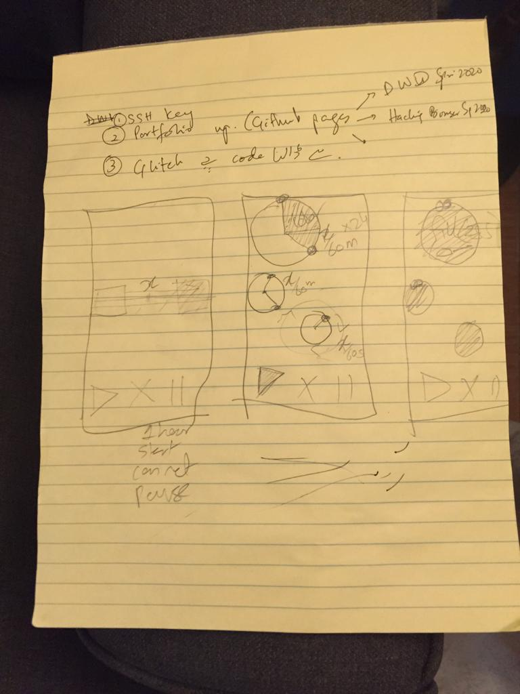
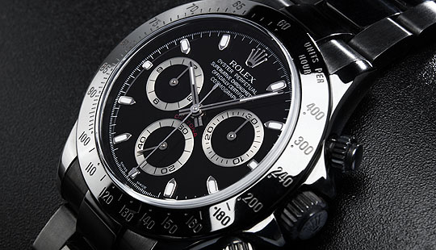

# Mobile Lab 

## Missile Launch Game, February 27, 2020

I understood that Gameboard like canvas of draw() is where functions are being called. CollisionObjects and Avatar classes are called here with avatarPosition parameters/variables passed in them. 

The classes are defined in separate files whose names match the class names. Variables are passed through eachother using the bind term.

The next logical step in this game was to have a missile fire and hit collisionObjects - and a condition similar to isAvatarInside inside collisionObject's fade should become true.

After thinking for a while and figuring out how the flow of code works, I started by getting a "fire" button ready in ControllerButtons.

```markdown
Button(action: {
                self.missilePosition.y += 20
            }) {
                Text("Firrre")
                    .font(.system(size: 14))
                    .frame(width: 60, height: 44)
                    .background(Color.black)
                    .foregroundColor(Color.white)
                    .cornerRadius(30)
            }
```
Then created a new file Missile.swift, similar to Avatar.swift -

```markdown
import SwiftUI
struct Missile: View {
    var position: CGPoint
    var body: some View {
        ZStack {
            Circle()
                .fill(Color.black)
                .frame(width: 100.0, height: 10.0)
        }
        .frame(width: 50, height: 50)
        .position(position)
        .animation(.easeInOut(duration: 0.2))
    }
}
struct Missile_Previews: PreviewProvider {
    static var previews: some View {
        GeometryReader { geometry in
            Missile(position: CGPoint(x: geometry.size.width / 2, y:  geometry.size.height / 2))
        }
    }
}
```

And updated Gameboard to include Missile(). Previews structs were updated on the go

```markdown
import SwiftUI
struct GameBoard: View {
    var avatarPosition: CGPoint
    var missilePosition:CGPoint
    var body: some View {
        GeometryReader { geometry in
            ZStack {
                Color.blue.opacity(0.26)
                // Place collision objects.
                CollisionObject(position: CGPoint(x: 100, y: 200), avatarPosition: self.avatarPosition, missilePosition: self.missilePosition)
                CollisionObject(position: CGPoint(x: 300, y: 300), avatarPosition: self.avatarPosition, missilePosition: self.missilePosition)
                CollisionObject(position: CGPoint(x: 200    , y: 500), avatarPosition: self.avatarPosition, missilePosition: self.missilePosition)
                // Place avatar.
                Avatar(position: self.avatarPosition)
                Missile(position: self.missilePosition)
            }
            .border(Color.blue, width: 6.0)
        }
    }
}
struct GameBoard_Previews: PreviewProvider {
    static var previews: some View {
        GeometryReader { geometry in
            GameBoard(avatarPosition: CGPoint(x: geometry.size.width / 2, y: geometry.size.height / 2), missilePosition: CGPoint(x: geometry.size.width / 2, y: geometry.size.height / 2))
        }
    }
}
```
 Then added logic similar to isAvatarInside() the CollisionObject - instead of writing a separate function, and calling it in other places, I chose not to repeat myself, and add else if statement:

```markdown
func isAvatarInside() -> Bool {
        if (position.x - size / 2.0) < avatarPosition.x && avatarPosition.x < (position.x + size / 2.0) &&
            (position.y - size / 2.0) < avatarPosition.y && avatarPosition.y < (position.y + size / 2.0) {
                return true
            } else if (position.x - size / 2.0) < missilePosition.x && missilePosition.x < (position.x + size / 2.0) &&
            (position.y - size / 2.0) < missilePosition.y && missilePosition.y < (position.y + size / 2.0) {
                return true
            }else {
                    return false
                }
        }
```
Finally, ContentView was updated to pass missilePosition parameters in classes GameBoard and ControllerButtons, and initializing missilePosition

```markdown
import SwiftUI
struct ContentView: View {
    @State var avatarPosition = CGPoint(x: 0, y: 0)
    @State var missilePosition = CGPoint(x: 0, y: 0)
    var body: some View {
        GeometryReader { geometry in
            Color.white
            ZStack {
                GameBoard(avatarPosition: self.avatarPosition, missilePosition: self.missilePosition)
                VStack {
                    Spacer()
                    HStack {
                        Spacer()
                        ControllerButtons(avatarPosition: self.$avatarPosition, missilePosition: self.$missilePosition)
                        Spacer()
                    }
                    .padding()
                }
            }
            .onAppear() {
                // Initialize position to center of the screen.
                self.avatarPosition = CGPoint(x: geometry.size.width / 2, y: geometry.size.height / 2)
                self.missilePosition = CGPoint(x: geometry.size.width / 2, y: geometry.size.height / 2)
            }
        }
    }
}
struct ContentView_Previews: PreviewProvider {
    static var previews: some View {
        ContentView()
    }
}
```
 In conclusion, the interaction I had set out to do - firing missile to Collision Object and for Object to fade, succeeded. However, this took more time than it seems to figure out how things worked and then iteratively coding the solution and making sure things worked along the way. And I was happy when my Build Succeeded.

 Next steps would be to improve the gameflow by adding more directions to missile (right now change is unidirectional on y-axis) and adding Vector/momentum to the GameBoard.

<iframe width="560" height="315" src="https://www.youtube.com/embed/JucEOUQy76k" frameborder="0" allow="accelerometer; autoplay; encrypted-media; gyroscope; picture-in-picture" allowfullscreen></iframe>


Code: [github](https://github.com/bsehgol/mobilelab/tree/master/mobile-lab-game-kit)


## Egg timer 

### Ideation & drawing up a wireframe



### Inspiration from Rollex gone awry..




### On the third stage of development,  as intended red blinks every second, and comes into focus in 60 seconds, and then resets. Yellow is supposed to blink once a minute, so it looks blurry, on the 60th minute it is in full focus. Green is supposed to blink once every hour.

<iframe width="560" height="315" src="https://www.youtube.com/embed/K5V6C260MyM?start=34" frameborder="0" allow="accelerometer; autoplay; encrypted-media; gyroscope; picture-in-picture" allowfullscreen></iframe>

### On the second stage, experimented with blink and blur, and associated that with timer. The idea is to blink every second while blur fills up every minute. For this if you take a look at TimeDisplay.swift, the transforEffect function is used in line 23

```markdown
.transformEffect(CGAffineTransform(rotationAngle: CGFloat(.pi*timeRemaining)))
```
### It's all over the place!

<iframe width="560" height="315" src="https://www.youtube.com/embed/u2P-6bNUz5A?start=34" frameborder="0" allow="accelerometer; autoplay; encrypted-media; gyroscope; picture-in-picture" allowfullscreen></iframe>


Please click [here](https://github.com/bsehgol/mobilelab/tree/master/mobile-lab-timer-kit) to view the github folder for this project.


